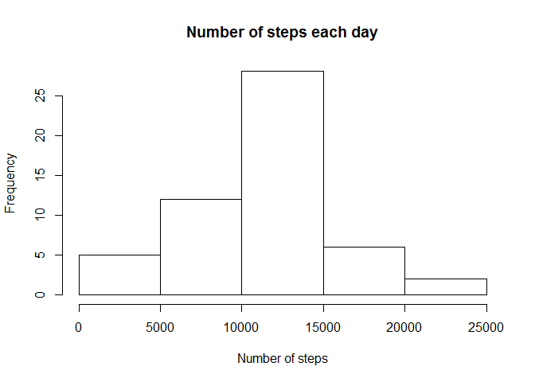
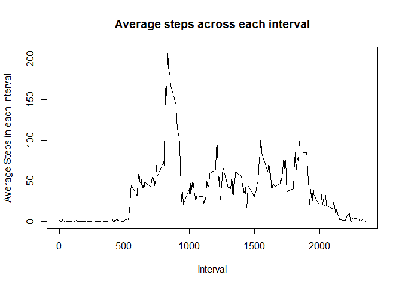
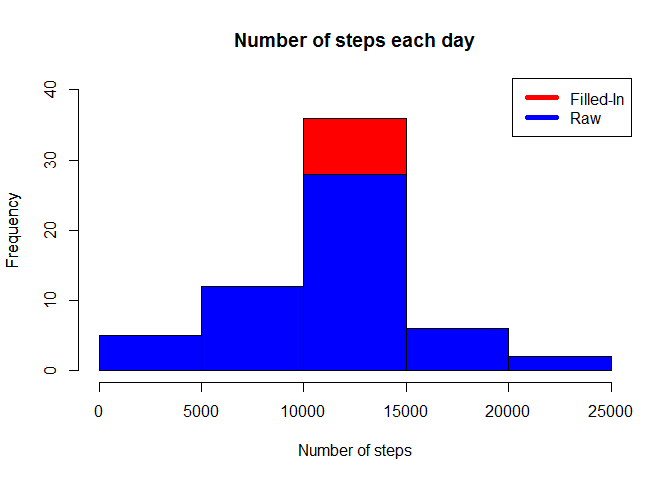

# Reproducible Research: Peer Assessment 1


## Loading and preprocessing the data


```r
activity <- read.csv("activity.csv")
```


## What is mean total number of steps taken per day?


```r
aggregateStepsPerDay <-
  aggregate(activity$steps ~ activity$date,FUN = sum,na.rm = T)
#the above gives total steps per day

#Make a histogram of the total number of steps taken each day
hist(aggregateStepsPerDay$`activity$steps`,xlab = "Number of steps",main =
       "Number of steps each day")
```

\

```r
#Calculate and report the mean and median of the total number of steps taken per day
mean(aggregateStepsPerDay$`activity$steps`)
```

```
## [1] 10766.19
```

```r
median(aggregateStepsPerDay$`activity$steps`)
```

```
## [1] 10765
```

```r
#The mean is 10766.19 and the median is 10765
```


## What is the average daily activity pattern?


```r
#Make a time series plot (i.e. type = "l") of the 5-minute interval (x-axis) and the average number of steps taken, averaged across all days (y-axis)
aggreagateInterval <-
aggregate(activity$steps ~ activity$interval,FUN = mean, na.rm = T)
plot(
aggreagateInterval$`activity$interval`,aggreagateInterval$`activity$steps`,type = "l",xlab = "Interval",ylab =
"Average Steps in each interval",main = "Average steps across each interval"
)
```

\

```r
#Which 5-minute interval, on average across all the days in the dataset, contains the maximum number of steps?
maxAggreagateInterval <-
aggreagateInterval[aggreagateInterval$`activity$steps` == max(aggreagateInterval$`activity$steps`),]
# the 835 interval has the maximum steps 206.17
```

## Imputing missing values

 

```r
  #Rows with missing values
  totalMissingVals <- nrow(activity) - nrow(complete)
#The total missing vals are 2304

  #A strategy for filling in all of the missing values in the dataset
  #Create a new dataset that is equal to the original dataset but with the missing data filled in.
  activityFilledIn <- activity
  for (i in 1:nrow(activity)) {
  if (is.na(activity$steps[i])) {
  activityFilledIn$steps[i] <-
  aggreagateInterval[aggreagateInterval$`activity$interval` == activity$interval[i],]$`activity$steps`
  
  }
  }
  #see differnce between non filled in and filled in data
  hist(
  aggregateStepsPerDayFilledIn$`activityFilledIn$steps`,col = "red",ylim =
  c(0,40),xlab = "",main = "",axes = FALSE
  )
  par(new = T)
  hist(
  aggregateStepsPerDay$`activity$steps`,col = "blue",xlab = "",main = "",ylim =
  c(0,40)
  )
  par(title(main = "Number of steps each day",xlab = "Number of steps"))
```

```
## named list()
```

```r
  legend("topright", c("Filled-In", "Raw"), col = c("red", "blue"), lwd =
  5)
```

\

```r
  #find mean and median
  mean(aggregateStepsPerDayFilledIn$`activityFilledIn$steps`)
```

```
## [1] 10766.19
```

```r
  median(aggregateStepsPerDayFilledIn$`activityFilledIn$steps`)
```

```
## [1] 10766.19
```

```r
  # mean on aggregate steps per day in filled in data set 10766.19
  # median on aggregate steps per day in filled in data set 10766.19
  
  #Calculate difference
  meanDiff <-
  mean(aggregateStepsPerDayFilledIn$`activityFilledIn$steps`) - mean(aggregateStepsPerDay$`activity$steps`)
  #There is no differenece in mean
  medianDiff <-
  median(aggregateStepsPerDayFilledIn$`activityFilledIn$steps`) - median(aggregateStepsPerDay$`activity$steps`)
  #There is a difference of 1.188 between medians (filled in is more)
  stepsDiff <-
  sum(aggreagateInterval$`activity$steps`) - sum(aggregateStepsPerDayFilledIn$`activityFilledIn$steps`)
  ##645971 steps more in filled in data
```

## Are there differences in activity patterns between weekdays and weekends?
	
 

```r
  #Create a new factor variable in the dataset with two levels – “weekday” and “weekend” indicating whether a given date is a weekday or weekend day.
  activityFilledIn$day <-
  ifelse(is.weekend(activityFilledIn$date),"Weekend","Weekday")
  activityFilledIn$day <- as.factor(activityFilledIn$day)
  #Make a panel plot containing a time series plot (i.e. type = "l") of the 5-minute interval (x-axis) and the average number of steps taken, averaged across all weekday days or weekend days (y-axis).
  aggDays <-
  aggregate(
  activityFilledIn$steps ~ activityFilledIn$interval + activityFilledIn$day, activityFilledIn, mean
  )
  library(lattice)
  xyplot(
  aggDays$`activityFilledIn$steps` ~ aggDays$`activityFilledIn$interval` |
  aggDays$`activityFilledIn$day`, main = "Average Steps per Day by Interval",xlab =
  "Interval", ylab = "Steps",layout = c(1,2), type = "l"
  )
```

\

```r
#It is seen that weekday has the greater activity peak. But weekend activity #distribution has better distribution, and more activity in a much less time than #weekdays
```
